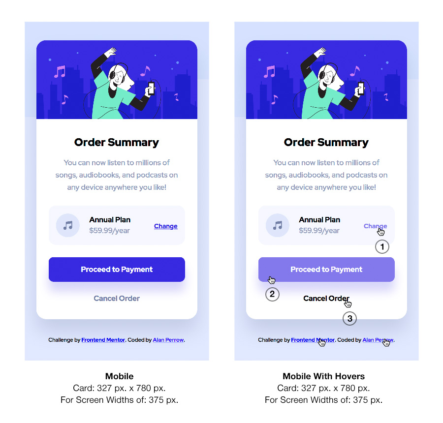
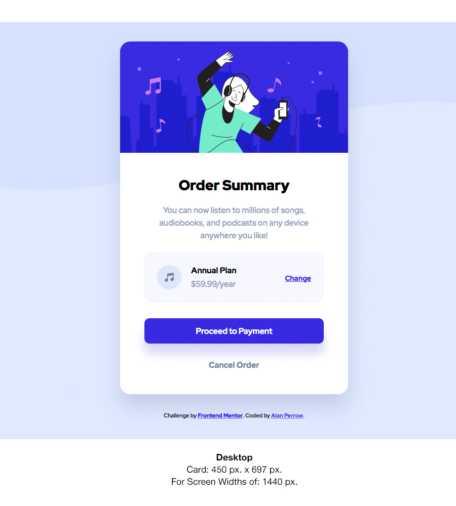

# Frontend Mentor - Order summary card solution

This is a solution to the [Order summary card challenge on Frontend Mentor](https://www.frontendmentor.io/challenges/order-summary-component-QlPmajDUj). Frontend Mentor challenges help you improve your coding skills by building realistic projects. 

## Table of contents

- [Overview](#overview)
  - [The challenge](#the-challenge)
  - [Screenshot](#screenshot)
  - [Links](#links)
- [My process](#my-process)
  - [Built with](#built-with)
  - [What I learned](#what-i-learned)
  - [Continued development](#continued-development)
  - [Useful resources](#useful-resources)
- [Author](#author)
- [Acknowledgments](#acknowledgments)

## Overview

### The challenge

Users should be able to:

- View the two optimal layouts depending on their device's screen size, as listed here.
  1. A mobile layout that maintains its size from 375px. – 1224px.
  2. A desktop layout that maintains its size 1225px. – infinity and beyond.
- See the hover states for the three interactive elements, as described below.
  1. On hover the word "change" on the annual plan section will become lighter.
  2. On hover the the "Proceed to Payment" button will become lighter.
  3. On hover the words "Cancel Order" will change from a medium gray to a black.
- Additional non-required hovers
  - Credit line text: Frontend Mentor will change from a bright blue to a desaturated blue and the underline with disappear.
  - Credit line text: coder's name will change from a bright blue to a desaturated blue and the underline with disappear.

  <br>


### Screenshots




The two screenshots above represent this solution as viewed in the Safari web browser on the Mac. Both screenshots are at 100%. The mobile view is present from 375px. – 1224px. and then the desktop view engages at 1225px. to infinity and beyond…

### Links

- Solution URL: [GitHub Repository — Solution Files](https://github.com/Stosh12/order-summary-component.git)
- Live Site URL: [GitHub Pages — Solution Website](https://stosh12.github.io/order-summary-component/)

## My process

### Built with

- Semantic HTML5 markup
- CSS custom properties
- Flexbox
- Mobile-first workflow
- Visual Studio Code
- MacDown to create the ReadMe file
- Photoshop for layout templates and ReadMe file screenshot edits

**Note: These are just examples. Delete this note and replace the list above with your own choices**

### What I learned

This challenge continued to aid in my learning about Flexbox. It gave me the opportunity to practice more with structuring my HTML for Flexbox and configuring my CSS selectors to work within that structure.

<br>

#### HTML

This is the HTML structure I created to work with Flexbox for the organization of the content within the Annual Plan box. The div with class, "annual-pan-info-box" became my Flexbox container for all the other items within the Annual Plan box. With this structure I was able to easily organize the content within that box per the design.

```html
    <div class="annual-plan-info-box">
    <svg class="music-symbol" xmlns="http://www.w3.org/2000/svg" width="48" height="48"><g fill="none" fill-rule="evenodd"><circle cx="24" cy="24" r="24" fill="#DFE6FB"/><path fill="#717FA6" fill-rule="nonzero" d="M32.574 15.198a.81.81 0 00-.646-.19L20.581 16.63a.81.81 0 00-.696.803V26.934a3.232 3.232 0 00-1.632-.44A3.257 3.257 0 0015 29.747 3.257 3.257 0 0018.253 33a3.257 3.257 0 003.253-3.253v-8.37l9.726-1.39v5.327a3.232 3.232 0 00-1.631-.441 3.257 3.257 0 00-3.254 3.253 3.257 3.257 0 003.254 3.253 3.257 3.257 0 003.253-3.253V15.81a.81.81 0 00-.28-.613z"/>
    </g></svg>
    <div class="annual-plan-group">
      <p class="annual-plan-heading">Annual Plan</p>
      <p class="year">$59.99/year</p>
    </div>
    <a  class="change" href="#">Change</a>
    </div>
```
<br>

#### CSS

The CSS below shows the "annual-plan-info-box" selector/container with its Flexbox specific properties and others. The Flexbox specific declarations are called out at the three following bullet points. Also, below this selector are the other selectors for the other elements within that Flexbox selector/container.

* display: flex;
* justify-content: space-between;
* align-items: center;

```css
.annual-plan-info-box {
    display: flex;
    justify-content: space-between;
    align-items: center;
    position: relative;
    width: 277px;
    height: 80px;
    background-color: var(--very-pale-blue);
    margin: 24px auto 25px auto;
    padding: 0px 0px 0px 0px;
    border-radius: 15px;
}
.music-symbol {
    position: relative;
    left: 15px;
    display: block;
    z-index: 1;
}
.annual-plan-group {
    position: relative;
    left: -14px;
    width: fit-content;
    font-family: 'Red Hat Display', sans-serif;
    font-weight: 500;
    font-size: 15px;
}
.annual-plan-heading {
    font-weight: 700;
    margin: 0px 0px 2px 0px;
}
.year {
    position: relative;
    color: hsl(224, 23%, 65%);
}
.change {
    position: relative;
    top: 2px;
    right: 15px;
    width: fit-content;
    font-family: 'Red Hat Display', sans-serif;
    font-weight: 700;
    font-size: 13px;
    color: var(--bright-blue);
}
.change:hover {
    color: hsl(245, 75%, 70%);
    text-decoration: none;
}
```
<br>

### Continued development

I would like to continue working with Flexbox and getting even better with it. I have found that it can be more efficient and easier to use than standard CSS positioning. CSS Grid, which I didn't use in this project, is another alternative to Flexbox; but its another CSS styling technique or method I would like to continue learning more about.

### Useful resources

- [CSS Flex Container](https://www.w3schools.com/css/css3_flexbox_container.asp) - This is good reference for Flexbox's Flex container properties and values. I didn't us this specifically; but it's content is similar to my notes from my previous experimentation and implementation of Flexbox.

## Author

- Website — Portfolio - [Alan Perrow](https://apmail127.myportfolio.com)
- Frontend Mentor - [@stosh12](https://www.frontendmentor.io/profile/stosh12)


## Acknowledgments

I give thanks to Frontend Mentor for creating and hosting these challenge, which have helped me learn more about front end Web Design coding!

